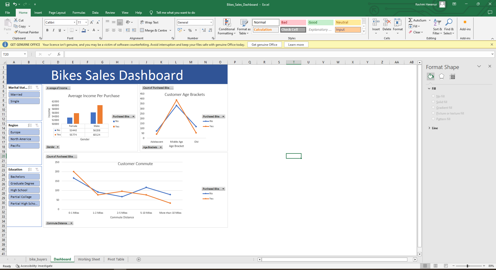

# Bikes Sales Dashboard - Excel

## Project Overview

This project presents an interactive Bikes Sales Dashboard created using Microsoft Excel.

The project analyzes bike sales data and explores customer demographics, income, commute distance, and purchasing behavior.

## Objectives

- Analyze bike purchasing patterns
- Explore customer demographics
- Analyze income and purchasing behavior
- Analyze commute distance
- Create an interactive Excel dashboard
- Present insights using Pivot Tables and Pivot Charts

## Tools Used

- Microsoft Excel
- Pivot Tables
- Pivot Charts
- Slicers
- Data Analysis
- Data Cleaning
- Kaggle Dataset

## Workbook Structure

The Excel workbook contains the complete analysis workflow:

### bike_buyers Dataset
Contains the original bike sales dataset used for the project.

### Working Sheet
Contains the working data and calculations used during the analysis.

### Pivot Tables
Contains Pivot Tables created to summarize and analyze the data.

### Dashboard
Contains the final interactive Bikes Sales Dashboard with charts, filters, and slicers.

## Dashboard Features

- Average Income per Purchase
- Customer Age Brackets
- Customer Commute Distance
- Gender-based analysis
- Regional filtering
- Education-level filtering
- Marital-status filtering
- Interactive dashboard filters

## Dashboard Preview

## Analysis

The dashboard was created to explore relationships between customer demographics, income, commute distance, and bike purchasing behavior.

## Project Files

| File | Description |
|---|---|
| `Bikes_Sales_Dashboard.xlsx` | Complete Excel analysis workbook |
| `screenshots/dashboard.png` | Dashboard preview |

## Author

Rashmi Havanur